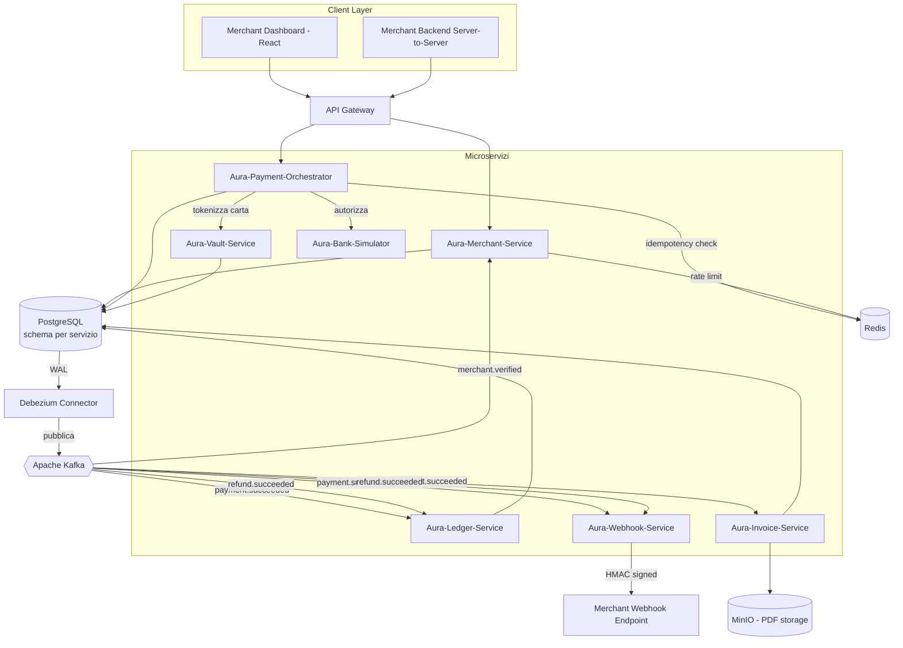
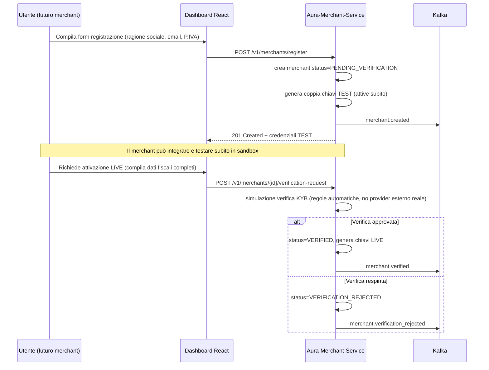
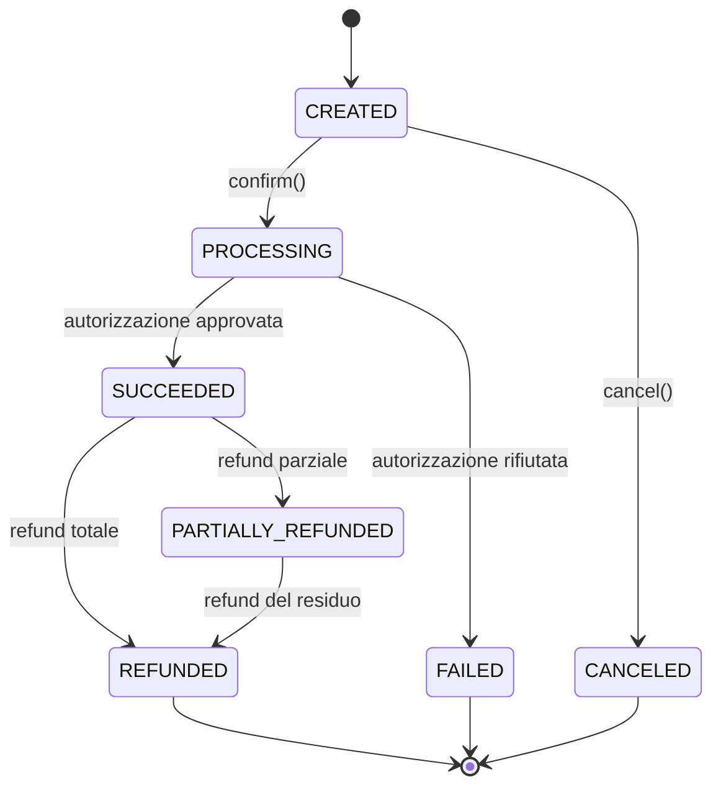
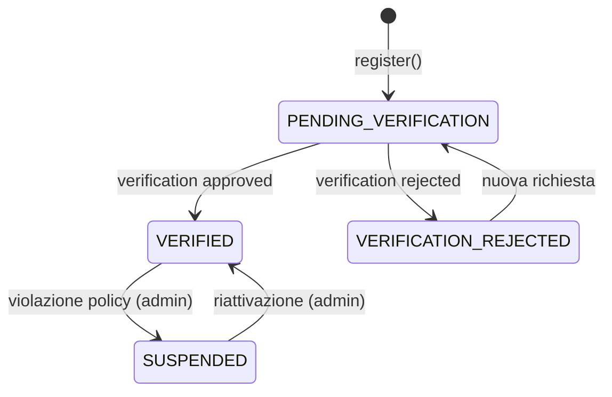
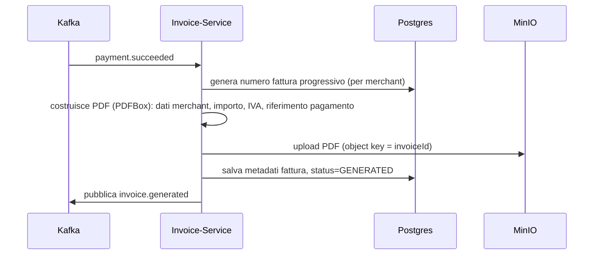

# AuraPay — Documentazione Tecnica di Progetto (v2)

**Payment Infrastructure Event-Driven**
Versione documento: 2.0 — supera e sostituisce la v1
Autore: Vincenzo — Progetto Portfolio
Ultimo aggiornamento: Luglio 2026

> Changelog rispetto alla v1: aggiunto ciclo di vita merchant e onboarding, modalità sandbox/live, servizio di fatturazione (Aura-Invoice-Service), catalogo eventi Kafka esteso a 18 eventi, dettaglio consumer group/partizionamento/DLQ, feature matrix completa del frontend.

---

## Indice

1. [Visione e Obiettivi di Progetto](#1-visione-e-obiettivi-di-progetto)
2. [Stack Tecnologico e Motivazioni](#2-stack-tecnologico-e-motivazioni)
3. [Architettura Generale](#3-architettura-generale)
4. [Ciclo di Vita del Merchant e Onboarding](#4-ciclo-di-vita-del-merchant-e-onboarding)
5. [Modalità Sandbox vs Live](#5-modalità-sandbox-vs-live)
6. [Microservizi — Specifica Dettagliata](#6-microservizi--specifica-dettagliata)
7. [Modello Dati per Servizio](#7-modello-dati-per-servizio)
8. [Catalogo Eventi Kafka](#8-catalogo-eventi-kafka)
9. [Kafka — Consumer Group, Partizionamento, Retry e DLQ](#9-kafka--consumer-group-partizionamento-retry-e-dlq)
10. [Macchina a Stati del PaymentIntent](#10-macchina-a-stati-del-paymentintent)
11. [Macchina a Stati del Merchant](#11-macchina-a-stati-del-merchant)
12. [Saga e Gestione della Compensazione](#12-saga-e-gestione-della-compensazione)
13. [Idempotenza](#13-idempotenza)
14. [Ledger a Partita Doppia](#14-ledger-a-partita-doppia)
15. [Rimborsi (Refunds)](#15-rimborsi-refunds)
16. [Fatturazione (Aura-Invoice-Service)](#16-fatturazione-aura-invoice-service)
17. [Sicurezza](#17-sicurezza)
18. [Osservabilità](#18-osservabilità)
19. [Strategia di Test](#19-strategia-di-test)
20. [Deployment Locale (Docker Compose)](#20-deployment-locale-docker-compose)
21. [Aura-Core-Lib — Libreria Condivisa](#21-aura-core-lib--libreria-condivisa)
22. [Frontend — Feature Matrix Completa](#22-frontend--feature-matrix-completa)
23. [Roadmap di Sviluppo a Fasi (sintesi — vedi Piano di Esecuzione)](#23-roadmap-di-sviluppo-a-fasi-sintesi--vedi-piano-di-esecuzione)
24. [Limiti Noti e Cosa Farei con Più Tempo](#24-limiti-noti-e-cosa-farei-con-più-tempo)

---

## 1. Visione e Obiettivi di Progetto

AuraPay è un progetto di portfolio che implementa, in scala ridotta ma con rigore realistico, i pattern architetturali usati dai moderni sistemi di pagamento (Stripe, Adyen, Braintree). L'obiettivo è dimostrare la capacità di progettare un sistema **event-driven, distribuito, e finanziariamente consistente**, affrontando problemi reali del dominio: doppia scrittura, arrotondamento monetario, idempotenza, tracciabilità contabile, isolamento dei dati sensibili.

Rispetto alla v1, questa versione copre l'intero ciclo di vita del sistema dal punto di vista di un merchant reale: **come si registra, come diventa operativo, come integra il servizio, come riceve le fatture, come monitora le notifiche webhook** — non solo il singolo happy path di pagamento. Il sistema **non gestisce denaro reale**: le chiamate bancarie sono simulate da `Aura-Bank-Simulator`, dichiarato esplicitamente per evitare ambiguità.

---

## 2. Stack Tecnologico e Motivazioni

| Componente | Tecnologia | Motivazione |
|---|---|---|
| Linguaggio / Framework | Java 21 + Spring Boot 3.x | Virtual Threads per gestire migliaia di chiamate I/O concorrenti con basso overhead |
| Database | PostgreSQL 16 | Transazioni ACID; nel dominio dei pagamenti la consistenza eventuale sul dato primario non è accettabile |
| Message Broker | Apache Kafka (KRaft mode) | Ordinamento per partition key, consumo indipendente multi-servizio dello stesso evento |
| Change Data Capture | Debezium | Transactional Outbox Pattern, elimina il rischio di dual-write |
| Cache / Idempotency | Redis 7 | Latenza sub-millisecondo per idempotenza e rate limiting |
| Generazione PDF | Apache PDFBox / OpenPDF | Generazione fatture lato server, nessuna dipendenza da servizi esterni a pagamento |
| Storage documenti | MinIO (S3-compatible, locale) | Simula storage oggetti reale con URL firmate, senza costi cloud |
| API Gateway | Spring Cloud Gateway | Punto di ingresso unico, routing, rate limiting di primo livello |
| Observability | Micrometer + OpenTelemetry + Zipkin | Tracing distribuito end-to-end |
| Frontend | React + TypeScript + Vite | SPA leggera per il Merchant Dashboard |
| Build | Maven multi-modulo | Gestione centralizzata di Aura-Core-Lib |

---

## 3. Architettura Generale



---

## 4. Ciclo di Vita del Merchant e Onboarding

Questo è il punto principale mancante nella v1: senza un flusso di onboarding, il sistema presuppone merchant già esistenti "per magia". Il flusso realistico è:



**Decisioni di design:**

- Le chiavi **test** sono generate immediatamente alla registrazione (nessun attrito per iniziare a integrare) — comportamento identico a Stripe
- Le chiavi **live** sono sbloccate solo dopo una verifica, qui **simulata** con regole deterministiche (es. P.IVA con checksum valido + email dominio aziendale non generico → approvato), dichiarato esplicitamente come simulazione e non vera due-diligence
- Un merchant `VERIFICATION_REJECTED` può ripresentare la richiesta — nessuno stato terminale bloccante

**Endpoint aggiuntivi in Aura-Merchant-Service:**

| Metodo | Path | Descrizione |
|---|---|---|
| POST | `/v1/merchants/register` | Self-service, crea merchant + chiavi test |
| POST | `/v1/merchants/{id}/verification-request` | Avvia verifica per sblocco modalità live |
| GET | `/v1/merchants/{id}/verification-status` | Stato corrente della verifica |
| GET | `/v1/merchants/{id}` | Profilo merchant completo |
| PUT | `/v1/merchants/{id}` | Aggiorna dati anagrafici/fiscali |

---

## 5. Modalità Sandbox vs Live

| Aspetto | Sandbox (test) | Live |
|---|---|---|
| Prefisso chiavi | `pk_test_...` / `sk_test_...` | `pk_live_...` / `sk_live_...` |
| Bank-Simulator | Sempre in uso (anche "live" resta simulato nel progetto) | Sempre in uso |
| Dati nel Ledger | Isolati per flag `is_test=true` | `is_test=false` |
| Fatture generate | Marcate "TEST — non fiscalmente valida" in watermark PDF | Nessun watermark |
| Webhook | Stesso meccanismo, payload include `"livemode": false` | `"livemode": true` |
| Requisito di attivazione | Nessuno | Merchant status = `VERIFIED` |

Questa separazione è modellata a livello di **colonna, non di schema separato** (`is_test BOOLEAN` su ogni tabella rilevante), scelta deliberata per tenere il modello dati semplice ma comunque corretto concettualmente.

---

## 6. Microservizi — Specifica Dettagliata

### 6.1 Aura-Merchant-Service
Vedi Sezione 4 per onboarding. Responsabilità aggiuntive: gestione API Key (creazione/revoca per ambiente test/live), rate limiting, configurazione webhook.

### 6.2 Aura-Payment-Orchestrator (Core)
Come da v1: macchina a stati PaymentIntent, idempotenza, coordinamento Vault/Bank. Aggiunta: propaga `is_test` derivato dal prefisso della API Key usata nella richiesta.

### 6.3 Aura-Vault-Service (PCI-Scoped, simulato)
Come da v1: tokenizzazione carta, mai persistenza PAN in chiaro.

### 6.4 Aura-Ledger-Service (Accounting)
Come da v1, con filtro `is_test` su ogni query di saldo (un merchant non deve mai vedere mischiati saldi sandbox e reali).

### 6.5 Aura-Webhook-Service
Come da v1: firma HMAC, retry con backoff esponenziale. Aggiunta: espone anche endpoint di **replay** per un intero intervallo temporale (utile in demo per mostrare recovery da downtime del merchant).

### 6.6 Aura-Bank-Simulator (Mock)
Come da v1, magic numbers per scenari di errore.

### 6.7 Aura-Invoice-Service (NUOVO)

**Responsabilità:** generazione automatica di fattura PDF per ogni pagamento andato a buon fine, storage e distribuzione tramite link firmato.

| Metodo | Path | Descrizione | Auth |
|---|---|---|---|
| GET | `/v1/invoices/{merchantId}` | Elenco fatture (paginato, filtrabile per periodo) | sk_ |
| GET | `/v1/invoices/{invoiceId}/download-url` | Genera URL firmata temporanea (validità 15 min) | sk_ |
| GET | `/v1/invoices/{invoiceId}` | Metadati fattura (numero, importo, stato) | sk_ |

**Flusso:** il servizio consuma `payment.succeeded`, genera un numero fattura progressivo per merchant (`INV-2026-000123`), produce il PDF con PDFBox (dati merchant, dettaglio importo, IVA se applicabile, riferimento al PaymentIntent), lo carica su MinIO, salva i metadati su Postgres, e pubblica `invoice.generated`.

Vedi Sezione 16 per il dettaglio completo.

---

## 7. Modello Dati per Servizio

### Aura-Merchant-Service — tabella `merchants`

| Colonna | Tipo | Note |
|---|---|---|
| id | UUID PK | |
| business_name | VARCHAR | |
| vat_number | VARCHAR(20) | validato con checksum |
| email | VARCHAR | |
| status | VARCHAR(30) | PENDING_VERIFICATION / VERIFIED / VERIFICATION_REJECTED / SUSPENDED |
| created_at | TIMESTAMP | |

Tabella `api_keys`: id, merchant_id, key_hash (BCrypt), key_prefix (per identificazione senza esporre il segreto), environment (TEST/LIVE), revoked_at nullable.

### Aura-Payment-Orchestrator — tabella `payment_intents` (invariata dalla v1)
Aggiunta colonna `is_test BOOLEAN NOT NULL`.

### Aura-Invoice-Service — tabella `invoices`

| Colonna | Tipo | Note |
|---|---|---|
| id | UUID PK | |
| invoice_number | VARCHAR | univoco per merchant, progressivo |
| merchant_id | UUID | |
| payment_intent_id | UUID | |
| amount_cents | BIGINT | |
| pdf_object_key | VARCHAR | riferimento all'oggetto su MinIO |
| status | VARCHAR(20) | GENERATED / FAILED |
| is_test | BOOLEAN | |
| created_at | TIMESTAMP | |

---

## 8. Catalogo Eventi Kafka

Rispetto ai 4 eventi della v1, il catalogo realistico copre l'intero ciclo di vita:

| # | Topic | Producer | Consumer | Trigger |
|---|---|---|---|---|
| 1 | `aura.merchant.created.v1` | Merchant-Service | (analytics futuro) | Registrazione self-service |
| 2 | `aura.merchant.verified.v1` | Merchant-Service | Webhook-Service | Verifica KYB approvata |
| 3 | `aura.merchant.verification_rejected.v1` | Merchant-Service | Webhook-Service | Verifica respinta |
| 4 | `aura.apikey.created.v1` | Merchant-Service | (audit log futuro) | Nuova API Key generata |
| 5 | `aura.apikey.revoked.v1` | Merchant-Service | (audit log futuro) | Revoca chiave |
| 6 | `aura.paymentintent.created.v1` | Payment-Orchestrator | (analytics futuro) | Creazione intent |
| 7 | `aura.payment.processing.v1` | Payment-Orchestrator | Webhook-Service | Autorizzazione avviata |
| 8 | `aura.payment.succeeded.v1` | Payment-Orchestrator | Ledger, Webhook, Invoice | Autorizzazione approvata |
| 9 | `aura.payment.failed.v1` | Payment-Orchestrator | Webhook-Service | Autorizzazione rifiutata |
| 10 | `aura.refund.requested.v1` | Payment-Orchestrator | (audit log futuro) | Richiesta rimborso ricevuta |
| 11 | `aura.refund.succeeded.v1` | Payment-Orchestrator | Ledger, Webhook, Invoice (nota di credito) | Rimborso completato |
| 12 | `aura.refund.failed.v1` | Payment-Orchestrator | Webhook-Service | Rimborso rifiutato (vincolo di dominio violato) |
| 13 | `aura.invoice.generated.v1` | Invoice-Service | Webhook-Service | PDF generato con successo |
| 14 | `aura.invoice.generation_failed.v1` | Invoice-Service | (alerting) | Errore generazione PDF |
| 15 | `aura.webhook.delivery_succeeded.v1` | Webhook-Service | (analytics futuro) | Consegna riuscita |
| 16 | `aura.webhook.delivery_dead_lettered.v1` | Webhook-Service | (alerting) | Esauriti i retry |
| 17 | `aura.ledger.entry_recorded.v1` | Ledger-Service | (analytics futuro) | Scrittura contabile completata |
| 18 | `aura.bank.authorization_result.v1` | Bank-Simulator | Payment-Orchestrator (in realtà via risposta sync, evento usato solo per audit) | Ogni esito di autorizzazione |

**Nota di scope:** non tutti i consumer "futuri" (analytics, audit log) sono implementati nell'MVP — i topic esistono comunque perché è la pubblicazione dell'evento, non l'esistenza del consumer, a definire il contratto. Questo è deliberato: dimostra comprensione del fatto che in un sistema event-driven i producer non devono conoscere i consumer.

**Esempio schema esteso `RefundSucceededEvent`:**
```json
{
  "eventId": "evt_2b8f91cc",
  "eventType": "refund.succeeded",
  "occurredAt": "2026-07-21T09:02:11Z",
  "refundId": "re_5f21ab",
  "paymentIntentId": "pi_7ac21f9e",
  "merchantId": "mch_8f21ac",
  "amountCents": 2000,
  "reason": "requested_by_customer",
  "isTest": false
}
```

---

## 9. Kafka — Consumer Group, Partizionamento, Retry e DLQ

Questo livello di dettaglio mancava completamente nella v1 e vale la pena esplicitarlo, perché è dove la maggior parte dei progetti "a microservizi" da portfolio si fermano a un livello superficiale.

**Partizionamento:** ogni topic ha 3 partizioni in dev (scalabile in produzione), chiave di partizione sempre `merchantId` — garantisce che tutti gli eventi di un merchant siano processati in ordine, mentre merchant diversi possono essere processati in parallelo da consumer diversi dello stesso group.

**Consumer group per servizio:**

| Servizio consumer | Consumer group id | Topic sottoscritti |
|---|---|---|
| Aura-Ledger-Service | `ledger-service-group` | payment.succeeded, refund.succeeded |
| Aura-Webhook-Service | `webhook-service-group` | tutti gli eventi "pubblici" (destinati al merchant) |
| Aura-Invoice-Service | `invoice-service-group` | payment.succeeded, refund.succeeded |

**Pattern di retry topic** (per il consumer, non per il webhook verso il merchant — quello ha la sua policy separata in Sezione 6.5):
```
aura.payment.succeeded.v1              (topic principale)
aura.payment.succeeded.v1.retry-30s    (primo fallimento di elaborazione)
aura.payment.succeeded.v1.dlq          (dopo N tentativi, per intervento manuale)
```
Se un consumer fallisce l'elaborazione (es. constraint violation transiente sul DB), il messaggio non viene scartato: viene ripubblicato sul topic `-retry-30s` con un header `retryCount`, e dopo un numero massimo di tentativi (es. 5) finisce nel topic `.dlq`, dove un endpoint amministrativo permette la review manuale — evitando sia il loop infinito sia la perdita silenziosa dell'evento.

**Semantica di consegna:** Kafka garantisce *at-least-once*. La combinazione con **consumer idempotenti** (deduplicazione tramite `eventId` salvato in una tabella `processed_events` per servizio, con constraint di unicità) porta il sistema a un comportamento *effectively-once* dal punto di vista applicativo — stesso pattern già adottato nel progetto NSTAR.

**Offset management:** commit manuale dopo elaborazione completata con successo (mai auto-commit), per evitare di perdere eventi in caso di crash del consumer a metà elaborazione.

---

## 10. Macchina a Stati del PaymentIntent



Aggiunto rispetto alla v1 lo stato `PARTIALLY_REFUNDED`, necessario ora che i rimborsi parziali multipli sono modellati esplicitamente (vedi Sezione 15).

---

## 11. Macchina a Stati del Merchant



Un merchant `PENDING_VERIFICATION` può comunque operare in modalità **test** — solo l'accesso alle chiavi live richiede `VERIFIED`.

---

## 12. Saga e Gestione della Compensazione

Invariata nella logica rispetto alla v1 (Saga coreografata Tokenizzazione → Autorizzazione → Ledger), ora estesa con lo step di generazione fattura come ulteriore consumer indipendente e non bloccante dell'evento `payment.succeeded` — se l'Invoice-Service fallisce, il pagamento resta comunque `SUCCEEDED` (la fattura non è nel percorso critico), ma l'evento `invoice.generation_failed` alimenta un alert.

---

## 13. Idempotenza

Invariata dalla v1: header `Idempotency-Key` obbligatorio, lock distribuito Redis, cache della risposta per 24h scoped per merchant e per ambiente (`is_test`).

---

## 14. Ledger a Partita Doppia

Invariato dalla v1: due righe bilanciate per pagamento (CREDIT PAYMENT / DEBIT FEE), saldo sempre calcolato come somma algebrica, mai da colonna aggiornata via UPDATE. Aggiunta: righe filtrate per `is_test`, così il saldo sandbox non inquina mai quello live.

---

## 15. Rimborsi (Refunds)

Esteso dalla v1 con supporto esplicito a rimborsi parziali multipli:

- Vincolo: `SUM(rimborsi già emessi) + importo_richiesto <= importo_originale`
- Ogni rimborso genera, oltre alla scrittura Ledger, una **nota di credito** nell'Invoice-Service (fattura di segno opposto collegata alla fattura originale)
- Stato `PARTIALLY_REFUNDED` sul PaymentIntent finché il residuo non è azzerato

---

## 16. Fatturazione (Aura-Invoice-Service)



**Numero fattura:** progressivo per merchant e per anno solare (`INV-2026-000123`), garantito univoco tramite sequence Postgres dedicata per merchant — dettaglio realistico perché in molti paesi (Italia inclusa) la numerazione fatture deve essere progressiva e senza salti per merchant.

**Download:** mai un URL statico permanente — si genera una URL firmata con scadenza (15 minuti), pattern identico a un vero bucket S3 con presigned URL, evitando che link di fatture (potenzialmente contenenti dati fiscali) restino accessibili indefinitamente se condivisi per errore.

**Contenuto PDF minimo:** intestazione merchant (ragione sociale, P.IVA), numero e data fattura, riferimento al PaymentIntent, importo, eventuale nota "documento generato in ambiente di test" se `is_test=true`.

---

## 17. Sicurezza

Invariata dalla v1 (API Key a doppia chiave, firma HMAC webhook, rate limiting), con aggiunta: le URL firmate delle fatture usano lo stesso meccanismo HMAC di Aura-Core-Lib, riutilizzando la stessa Security Utils invece di reinventare la logica nel nuovo servizio — coerenza cross-servizio.

---

## 18. Osservabilità

Invariata dalla v1. Aggiunta metrica specifica: lag del consumer group `invoice-service-group` (se cresce, significa che le fatture non vengono generate in tempo utile — allarme dedicato).

---

## 19. Strategia di Test

Invariata dalla v1, con aggiunta di test di integrazione specifici per Invoice-Service (generazione PDF verificata controllando dimensione file e presenza testo atteso via estrazione testo, non solo "non è null").

---

## 20. Deployment Locale (Docker Compose)

Aggiunto rispetto alla v1: container MinIO con bucket di init automatico via script, container Aura-Invoice-Service.

---

## 21. Aura-Core-Lib — Libreria Condivisa

Invariata dalla v1, con aggiunta dei DTO per i nuovi eventi (sezione 8) e utility comune per generazione/validazione URL firmate.

---

## 22. Frontend — Feature Matrix Completa

La v1 si limitava a "saldo + lista transazioni". Ecco la scomposizione realistica per moduli:

| Modulo | Funzionalità | Priorità MVP |
|---|---|---|
| **Onboarding** | Form registrazione, conferma email (simulata), visualizzazione chiavi test generate | Alta |
| **Verifica Live** | Form dati fiscali completi, stato verifica (pending/approved/rejected) | Media |
| **API Keys** | Elenco chiavi (test/live), creazione, revoca, copia negli appunti | Alta |
| **Dashboard Home** | Saldo disponibile/pending, grafico transazioni ultimi 30gg | Alta |
| **Transazioni** | Lista paginata con filtri (stato, data, ambiente test/live), dettaglio con timeline eventi | Alta |
| **Rimborsi** | Azione "Rimborsa" (totale/parziale) dal dettaglio transazione | Alta |
| **Fatture** | Lista fatture, download PDF tramite URL firmata | Media |
| **Webhook** | Configurazione URL endpoint, storico consegne con stato, retry manuale su Dead Letter | Media |
| **Impostazioni** | Dati anagrafici merchant, cambio ambiente test/live nella UI | Bassa |

**Nota di scope per l'MVP portfolio:** dei moduli sopra, "Onboarding", "API Keys", "Dashboard Home", "Transazioni" e "Rimborsi" sono l'insieme minimo che rende la demo credibile e mostrabile in un colloquio. "Fatture" e "Webhook" sono il secondo livello di priorità (aggiungono profondità ma non sono indispensabili per il primo showcase). "Impostazioni" è puro contorno, ultima priorità.

---

## 23. Roadmap di Sviluppo a Fasi (sintesi — vedi Piano di Esecuzione)

Questa sezione resta volutamente di alto livello: la pianificazione granulare, task per task, è demandata al documento separato **AURAPAY_PIANO_ESECUZIONE.md**, per non mescolare "cosa costruiamo" con "in che ordine e con quali task lo costruiamo".

---

## 24. Limiti Noti e Cosa Farei con Più Tempo

- Nessuna vera integrazione PCI-DSS, KYB, o gateway bancario reale — tutto simulato e dichiarato come tale
- Fatture generate non hanno valore fiscale reale (mancano requisiti come SDI/fatturazione elettronica italiana, volutamente fuori scope)
- Nessuna gestione multi-valuta con conversione FX
- Nessuna gestione dispute/chargeback (modellabile come estensione futura, stesso pattern del refund ma iniziato dalla banca simulata invece che dal merchant)
- Con più tempo: un vero Saga Orchestrator per i flussi a più step, un modulo di riconciliazione automatica, e supporto a dispute/chargeback come ulteriore dimostrazione di gestione di un caso limite del dominio
